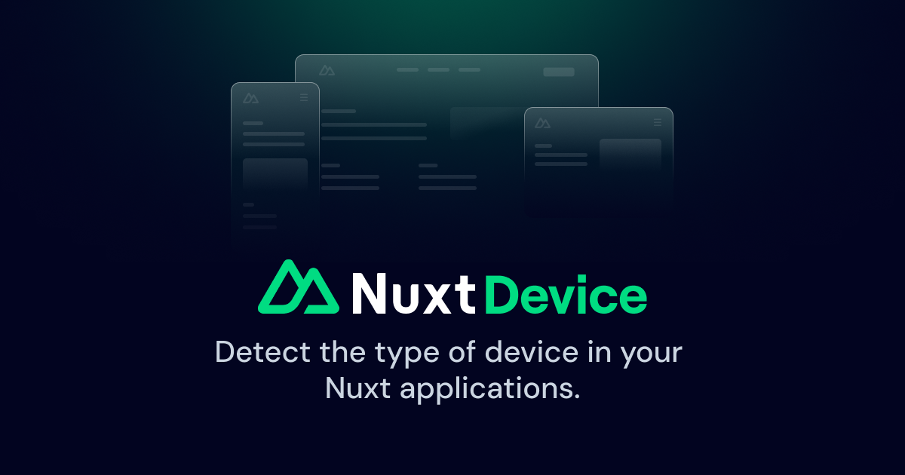

# Nuxt Device

[![npm version][npm-version-src]][npm-version-href]
[![npm downloads][npm-downloads-src]][npm-downloads-href]
[![License][license-src]][license-href]
[![Nuxt][nuxt-src]][nuxt-href]

Detect the type of device in your Nuxt applications.

See [demo on CodeSandbox](https://codesandbox.io/s/github/nuxt-community/device-module).

## Installation

```bash
npx nuxi@latest module add device
```

> [!NOTE]
> You can find the Nuxt 2 version of the module on the [`2.x` branch](https://github.com/nuxt-modules/device/tree/2.x).

## Flags

You can use the following flags to detect the device type:

- `$device.isDesktop`
- `$device.isMobile`
- `$device.isTablet`
- `$device.isMobileOrTablet`
- `$device.isDesktopOrTablet`
- `$device.isIos`
- `$device.isLinux`
- `$device.isWindows`
- `$device.isMacOS`
- `$device.isApple`
- `$device.isAndroid`
- `$device.isFirefox`
- `$device.isEdge`
- `$device.isChrome`
- `$device.isSafari`
- `$device.isSamsung`
- `$device.isCrawler`

The user agent is also injected and accessible with `$device.userAgent`.

The crawler detection is powered by the [crawler-user-agents](https://github.com/monperrus/crawler-user-agents) package.

## Usage

You can either use the `useDevice()` composable inside a `script setup`, or the `$device` helper directly in the template:

```vue
<template>
  <div>
    <div v-if="$device.isDesktop">Desktop</div>

    <div v-else-if="$device.isTablet">Tablet</div>

    <div v-else>Mobile</div>
  </div>
</template>

<script setup>
const { isMobile } = useDevice()
</script>
```

### Changing Layout Dynamically

```vue
<template>
  <div>
    <NuxtLayout :name="$device.isMobile ? 'mobile' : 'default'">
      <!-- page content -->
    </NuxtLayout>
  </div>
</template>

<script setup>
definePageMeta({
  layout: false
})
</script>
```

<!-- ### Adding a Custom Flag

You can add other flags to `$device` by adding a [Nuxt plugin](https://nuxtjs.org/docs/2.x/directory-structure/plugins):

```js
// plugins/custom-flag.js
export default function ({ $device }) {
  $device.isCustom = $device.userAgent.includes('Custom-Agent') ? true : false
}
``` -->

### Options

#### `defaultUserAgent`

Sets the default value for the `user-agent` header (useful when running `npm run generate`).

Default: `Mozilla/5.0 (Macintosh; Intel Mac OS X 10_13_2) AppleWebKit/537.36 (KHTML, like Gecko) Chrome/64.0.3282.39 Safari/537.36`

#### `enabled`

Enables the module conditionally.

Default: `true`

> [!WARNING]
> This option is deprecated. It will be removed in the next major release.

#### `refreshOnResize`

Refreshes flags on window resize.

Default: `false`

> [!WARNING]
> This option is deprecated. It will be removed in the next major release.

## Amazon CloudFront Support

If the user agent is `Amazon CloudFront`, the module checks for the following headers:  

- `CloudFront-Is-Android-Viewer`
- `CloudFront-Is-Desktop-Viewer`
- `CloudFront-Is-IOS-Viewer`
- `CloudFront-Is-Mobile-Viewer`
- `CloudFront-Is-Tablet-Viewer`

Read more about determining the viewer's device type in the [Amazon CloudFront docs](https://docs.aws.amazon.com/AmazonCloudFront/latest/DeveloperGuide/adding-cloudfront-headers.html#cloudfront-headers-device-type).

> [!CAUTION]
> `isWindows` and `isMacOS` flags are not available in Amazon CloudFront.

## Cloudflare Support

This module checks for the `CF-Device-Type` header.

Read more about the device type detection in the [Cloudflare docs](https://developers.cloudflare.com/automatic-platform-optimization/reference/cache-device-type).

## License

[MIT License](./LICENSE)

<!-- Badges -->
[npm-version-src]: https://img.shields.io/npm/v/@nuxtjs/device/latest.svg?style=flat&colorA=18181B&colorB=28CF8D
[npm-version-href]: https://npmjs.com/package/@nuxtjs/device

[npm-downloads-src]: https://img.shields.io/npm/dm/@nuxtjs/device.svg?style=flat&colorA=18181B&colorB=28CF8D
[npm-downloads-href]: https://npmjs.com/package/@nuxtjs/device

[license-src]: https://img.shields.io/github/license/nuxt-modules/device.svg?style=flat&colorA=18181B&colorB=28CF8D
[license-href]: https://github.com/nuxt-modules/device/blob/main/LICENSE

[nuxt-src]: https://img.shields.io/badge/Nuxt-18181B?logo=nuxt.js
[nuxt-href]: https://nuxt.com
