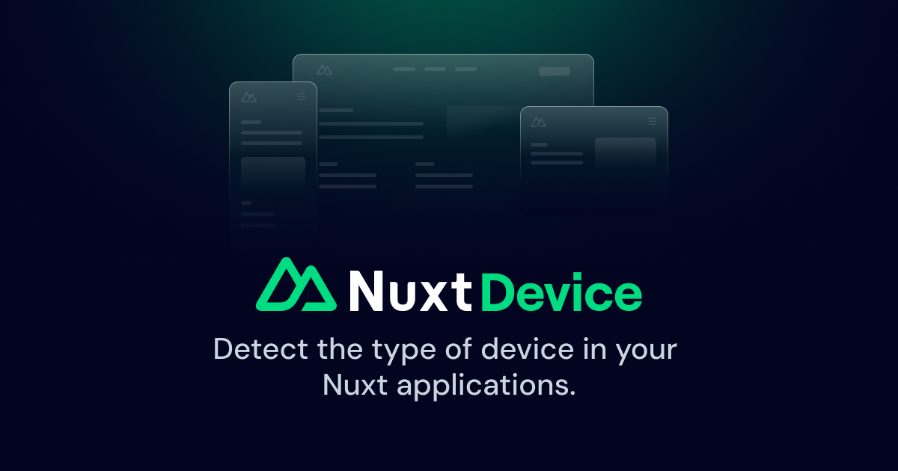

# Nuxt Device

[![npm version][npm-version-src]][npm-version-href]
[![npm downloads][npm-downloads-src]][npm-downloads-href]
[![License][license-src]][license-href]
[![Nuxt][nuxt-src]][nuxt-href]

Detect the type of device in your Nuxt applications.

- [👾 &nbsp;Playground](https://stackblitz.com/github/nuxt-modules/device?file=playground%2Fapp%2Fapp.vue)

## Installation

```bash
npx nuxt module add device
```

## Flags

You can use the following flags to detect the device type:

- `$device.isDesktop`
- `$device.isMobile`
- `$device.isTablet`
- `$device.isMobileOrTablet`
- `$device.isDesktopOrTablet`
- `$device.isIos`
- `$device.isLinux`
- `$device.isWindows`
- `$device.isMacOS`
- `$device.isApple`
- `$device.isAndroid`
- `$device.isFirefox`
- `$device.isEdge`
- `$device.isChrome`
- `$device.isSafari`
- `$device.isSamsung`
- `$device.isCrawler`

The user agent is also injected and accessible with `$device.userAgent`.

If a request has no `User-Agent` header, `$device.userAgent` is an empty string and the device is treated as a desktop with an unknown OS and browser.

The crawler detection is powered by the [crawler-user-agents](https://github.com/monperrus/crawler-user-agents) package.

## Usage

You can either use the `useDevice()` composable inside a `script setup`, or the `$device` helper directly in the template:

```vue
<template>
  <div>
    <div v-if="$device.isDesktop">Desktop</div>

    <div v-else-if="$device.isTablet">Tablet</div>

    <div v-else>Mobile</div>
  </div>
</template>

<script setup>
const { isMobile } = useDevice()
</script>
```

### Changing Layout Dynamically

```vue
<template>
  <div>
    <NuxtLayout :name="$device.isMobile ? 'mobile' : 'default'">
      <!-- page content -->
    </NuxtLayout>
  </div>
</template>

<script setup>
definePageMeta({
  layout: false
})
</script>
```

## Static Generation

Static generation (e.g. `nuxt generate`) is not supported. Prerendered pages are rendered once at build time without a user agent, so they are always treated as a desktop. Similarly, responses cached on the server (e.g. with `swr` or `isr` route rules) keep the flags of the request they were cached from.

To detect the device on each request, deploy with `nuxt build` instead. For a client-side only app, set `ssr: false` to detect the device in the browser.

## Amazon CloudFront Support

When [CloudFront device detection](https://docs.aws.amazon.com/AmazonCloudFront/latest/DeveloperGuide/adding-cloudfront-headers.html#cloudfront-headers-device-type) is enabled, the module checks for the following headers, regardless of the incoming user agent:

- `CloudFront-Is-Android-Viewer`
- `CloudFront-Is-Desktop-Viewer`
- `CloudFront-Is-IOS-Viewer`
- `CloudFront-Is-Mobile-Viewer`
- `CloudFront-Is-Tablet-Viewer`

These headers take precedence over user agent parsing. This works both when CloudFront forwards the viewer's browser user agent and when it replaces it with `Amazon CloudFront`.

Read more about determining the viewer's device type in the [Amazon CloudFront docs](https://docs.aws.amazon.com/AmazonCloudFront/latest/DeveloperGuide/adding-cloudfront-headers.html#cloudfront-headers-device-type).

> [!NOTE]
> If CloudFront replaces the user agent with `Amazon CloudFront`, `isWindows`, `isMacOS` and the browser flags can't be detected, because the original user agent is no longer available. Forward the `User-Agent` header to the origin (in your cache or origin request policy) if you need them.

## Cloudflare Support

This module checks for the `CF-Device-Type` header.

Read more about the device type detection in the [Cloudflare docs](https://developers.cloudflare.com/automatic-platform-optimization/reference/cache-device-type).

## License

[MIT License](./LICENSE)

<!-- Badges -->
[npm-version-src]: https://img.shields.io/npm/v/@nuxtjs/device/latest.svg?style=flat&colorA=18181B&colorB=28CF8D
[npm-version-href]: https://npmjs.com/package/@nuxtjs/device

[npm-downloads-src]: https://img.shields.io/npm/dm/@nuxtjs/device.svg?style=flat&colorA=18181B&colorB=28CF8D
[npm-downloads-href]: https://npmjs.com/package/@nuxtjs/device

[license-src]: https://img.shields.io/github/license/nuxt-modules/device.svg?style=flat&colorA=18181B&colorB=28CF8D
[license-href]: https://github.com/nuxt-modules/device/blob/main/LICENSE

[nuxt-src]: https://img.shields.io/badge/Nuxt-18181B?logo=nuxt.js
[nuxt-href]: https://nuxt.com
